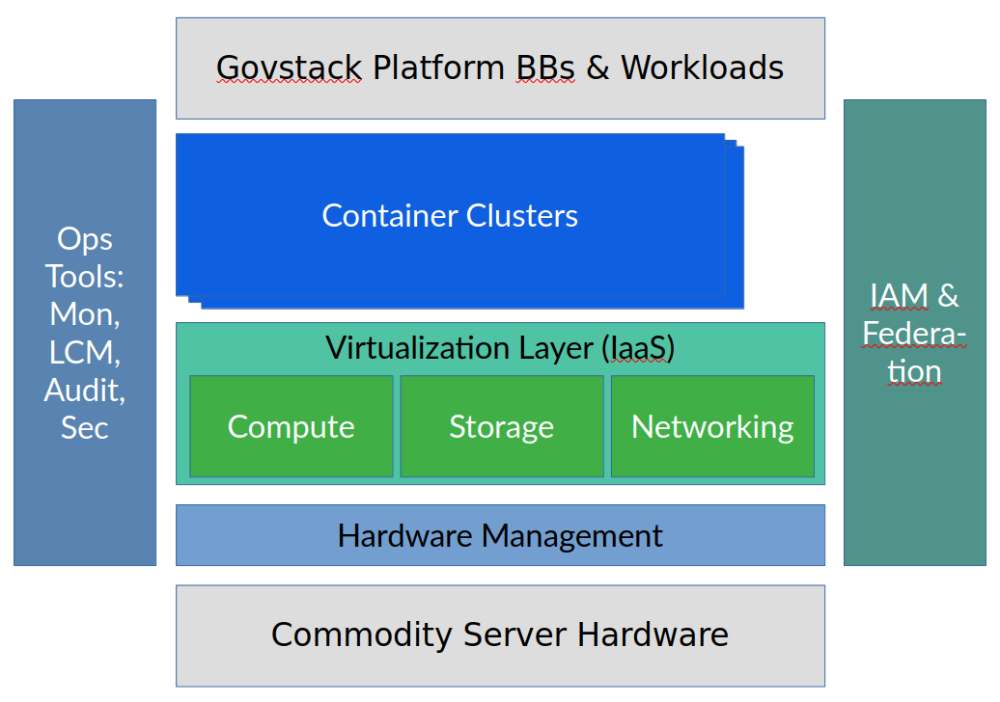

# SCS training: Introduction

## Digital Sovereignty

* Sovereignty is the ability to decisions about your fate yourself and be very
  deliberate which dependencies with what risks you are willing to accept.
* Digital platforms tend to come with strong dependencies.
* SCS has
  [published](https://the-report.cloud/why-digital-sovereignty-is-more-than-mere-legal-compliance/)
  a four-level taxonomy for digital sovereignty for infrastructure platforms

### Four pillars of Sovereignty

1. Data Sovereignty: The ability to decide where to store data and to (independently)
   decide with whom to share data and metadata.

2. Provider Switchability: Freedom of choice between several providers and
   the ability to easily switch between them.

3. Technical Sovereignty: The ability to study technology, to shape it according
   to your needs, to innovate and to contribute.

4. Open Operations: The ability to acquire the knowledge and skills from
   documentation, knowledge sharing and learning events, transparency on
   operational processes in order to be capable to operate your own
   infrastructure.

### About Sovereign Cloud Stack
* The idea is to leverage mature Open Source Software (OSS) to support digital sovereignty
    - The challenge is to integrate them in a coherent and standardized way to create
      standards and a mature product that can be operated without too much scarce expert knowledge.
* This is done in several ways:
    1. By making it easier for local providers and allow self-hosting, data sovereignty is supported.
    2. By having many provider adhering to the same [technical standards](https://docs.scs.community/standards), switching providers becomes a lot easier. The standards are covered by [automated continuous tests](https://github.com/SovereignCloudStack/standards/Tests/) and can be certified (*SCS-compatible*)
    3. By having an openly developed complete open source [reference implementation](https://docs.scs.community/docs/category/releases), everyone
       can adjust technology, innovate on and contribute to it, thus delivering on technical sovereignty (*SCS-open*). This includes the ability to create and capture value at all layers.
    4. By giving transparency into operations (e.g. via blog articles, OSHM, Lean Operator Coffee),
       some collaborative element is added to the Ops part of DevOps. [Open Operations](https://openoperations.org/) thus enables the highest level (*SCS-sovereign*).
* SCS is a project by the Open Source Business Alliance e.V. ([OSBA](https://osb-alliance.de/)) in Europe in the [Gaia-X](https://gaia-x.eu/) context and has received public funding from German [BMWK](https://bmwk.bund.de/) 2021 -- 2024.
* It has collaboratively and openly developed and released 5 versions of *SCS-compatible* IaaS standards,
  1 version of KaaS standards, 8 releases of the reference implementation, has organized two own conferences (SCS summits), 4 Hackathons and has contributed to numerous publications and conferences.
* The standards evolution is now governed by the [Forum SCS-Standards](https://sovereigncloudstack.org/) in the non-profit OSBA, whereas the software development is continued by the OSS companies in the SCS community, governed by the [SCS project board](https://docs.scs.community/standards/scs-0005-v1-project-governance).

## GovStack
* GovStack <https://govstack.global/> is an international project to
    - Specify building blocks that support governments to provide digital services to their citizens, businesses, civil society, ... ([GovSpecs](https://www.govstack.global/our-offerings/govspecs/)) 
    - Tests for compliance with GovSpecs ([GovTest](https://www.govstack.global/our-offerings/govtest/))
    - Learning opportunities around the GovSpec Building Blocks ([GovLearn](https://www.govstack.global/our-offerings/govlearn/))
    - Implementations of these specifications ([GovMarket](https://www.govstack.global/our-offerings/govmarket/)) 
* A number of blocks have been specified, identity management, payment, etc., see <https://govstack.gitbook.io>
    - One of them is a cloud building block  
      
* Govstack is supported by German [BMZ](https://www.bmz.de/en), [GIZ](https://giz.de/), [DIAL](https://dial.global/), [ITU](https://itu.int), [Estonia](https://vm.ee/en)

### SCS and GovStack
* The SCS project has contributed to the GovStack cloud building block,
  reflecting some high level principles behind the standardization.
* The SCS reference implementation fulfills the GovStack Cloud BB's
  specifications and is thus listed on the GovMarket.
* The trainings are a contribution to spread the skills and this way support
  Digital Sovereignty. Thanks!

