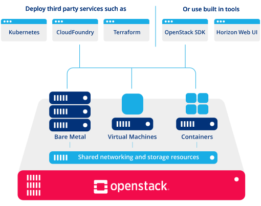
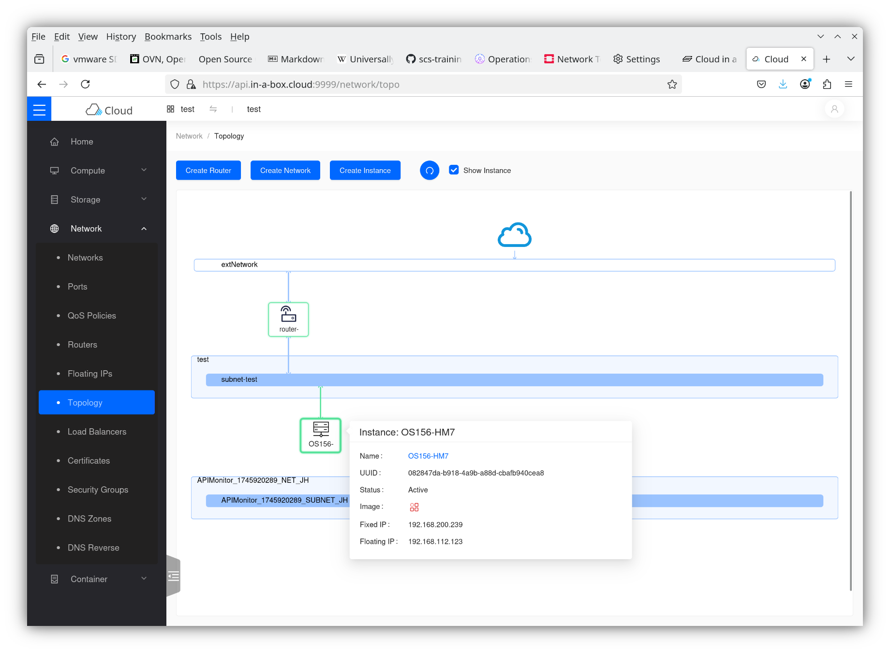

## OpenStack Architecture overview

### What is it?

A set of services that manages virtualized resources and gives users
interfaces to control these.



### How is it built?

* API services
    * Independent processes for Compute, Block Storage, Images, Networking, LoadBalancers, Identity, etc.
    * All APIs are RESTful APIs
        * GET, POST, PUT, PATCH, DELETE verbs for list, create, set, change and delete operations
        * Many APIs are paginated, i.e. GET returns only a subset of resources
* Some APIs have background services
    * Conductors, Schedulers, etc.
* Services talk to each other via REST API or via RabbitMQ
* Database keeps tables for the state of resources
    * Tables are each owned by one service
* Identity service has a central role

### Keystone: Identity service has a central role
* User authenticates to keystone (typically with some secret) and gets a token
* Token can be validated by individual services
* Tokens have a scope that determines what you can do with them
    * Unscoped
    * Domain scope
    * Project scope
* Identity service hosts the service catalogue

### Keystone: Raw REST API example (against CiaB)
* Discovery (`--cacert ...` needed b/c of self-signed certificate)
```bash
dragon@cumulus(//):~ [4]$ curl -sS -g --cacert "/etc/ssl/certs/ca-certificates.crt" \
    -X GET https://api.in-a-box.cloud:5000/v3 \
    -H "Accept: application/json" | jq .
```
```json
{
  "version": {
    "id": "v3.14",
    "status": "stable",
    "updated": "2020-04-07T00:00:00Z",
    "links": [
      {
        "rel": "self",
        "href": "https://api.in-a-box.cloud:5000/v3/"
      }
    ],
    "media-types": [
      {
        "base": "application/json",
        "type": "application/vnd.openstack.identity-v3+json"
      }
    ]
  }
}
```
The services are versioned and have versioned (and microversioned) APIs.

* Password authentication
```bash
curl -sS --cacert "/etc/ssl/certs/ca-certificates.crt" \
-X POST https://api.in-a-box.cloud:5000/v3/auth/tokens \
-H "Accept: application/json" -H "Content-Type: application/json" -d '
> {
  "auth": {
    "identity": {
      "methods": [
        "password"
      ],
      "password": {
        "user": {
          "name": "test",
          "password": "test",
          "domain": {
            "name": "test"
          }
        }
      }
    }
  },
  "scope": {
    "project": {
      "name": "test"
    }
  }
}
' | jq
```
```json
{
  "token": {
    "methods": [
      "password"
    ],
    "user": {
      "domain": {
        "id": "b294a22221d54c909557f23b65a53166",
        "name": "test"
      },
      "id": "b4438103db904341b88e0e5f9d9f5540",
      "name": "test",
      "password_expires_at": null
    },
    "audit_ids": [
      "lmk5WwvXR5eBvBx2Dh2z5w"
    ],
    "expires_at": "2025-05-08T14:38:37.000000Z",
    "issued_at": "2025-05-07T14:38:37.000000Z",
    "project": {
      "domain": {
        "id": "b294a22221d54c909557f23b65a53166",
        "name": "test"
      },
      "id": "0ecdbb271d8245f0b458bc1e4526a133",
      "name": "test"
    },
    "is_domain": false,
    "roles": [
      {
        "id": "4095d94d72cb484b85d204d5b5ef913e",
        "name": "reader"
      },
      {
        "id": "72ca54fa55c24fa69c4bdd0803e8014c",
        "name": "member"
      },
      {
        "id": "aaf15f40660a4e58bcd80b661ca30061",
        "name": "load-balancer_member"
      },
      {
        "id": "0c9a55df33a94b55bdcf7bb652b88e22",
        "name": "creator"
      }
    ],
    "catalog": [
      {
        "endpoints": [
          {
            "id": "3b95334448364dab92bd46e75dcab326",
            "interface": "public",
            "region_id": "RegionOne",
            "url": "https://api.in-a-box.cloud:9998",
            "region": "RegionOne"
          },
          {
            "id": "b74a9a69c48b4f44993d6b6cede248c1",
            "interface": "internal",
            "region_id": "RegionOne",
            "url": "https://api.in-a-box.cloud:9998",
            "region": "RegionOne"
          }
        ],
        "id": "037ce0fe8e5246a58f2ca435e321834f",
        "type": "panel",
        "name": "skyline"
      },
[...]
      {
        "endpoints": [
          {
            "id": "737da81d4d7e43e7b2d9ced0dec2ab36",
            "interface": "public",
            "region_id": "RegionOne",
            "url": "https://api.in-a-box.cloud:8780",
            "region": "RegionOne"
          },
          {
            "id": "e49affd2bb0341c5ad30cd4b3bd4bb1a",
            "interface": "internal",
            "region_id": "RegionOne",
            "url": "https://api.in-a-box.cloud:8780",
            "region": "RegionOne"
          }
        ],
        "id": "f7a6b12baa5b46c094a647356c7b54b0",
        "type": "placement",
        "name": "placement"
      }
    ]
  }
}
```

* All services are identified by unique 16byte ids, resources also carry 16 byte uuids (typically in 8-4-4-4-12 notation).
  Tools typically support addressing resources by name, but names are *not* enforced to be unique everywhere.

* Much easier: Store keystone endpoint and credentials in `~/.config/openstack/clouds.yaml` and `secure.yaml` and
  issue `openstack --os-cloud test catalog list`.

`~/.config/openstack/clouds.yaml`
```yaml
---
clouds:
  test:
    auth:
      username: test
      project_name: test
      auth_url: https://api.in-a-box.cloud:5000/v3
      project_domain_name: test
      user_domain_name: test
    cacert: /etc/ssl/certs/ca-certificates.crt
    identity_api_version: 3
```

`~/.config/openstack/secure.yaml`
```yaml
---
clouds:
  test:
    auth:
      password: test
```


### OpenStack Core services
| Type | Name | Function |
|------|------|----------|
| identity | keystone | Identity and Access management |
| network | neutron | Networking (L2+L3) |
| volumev3 | cinder | Block Storage (virtual hard disks) |
| image | glance | Image handling |
| compute | nova | VM management |
| object-store | swift | Object storage (S3-like) -- optional for SCS |

All core services (except Swift) need to be present for SCS-compatible IaaS compliance.
Note on swift: We require an S3 compatible service. (Ideally, both S3 and Swift are offered.)

Note on terminology: OpenStack calls hosts (hardware nodes) hypervisors and VMs instances or servers.

### Other standard OpenStack services
| Type | Name | Function and Notes |
|------|------|--------------------|
| orchestration | heat | Deploy sets of resources (like cloudformation, heat-cfn) |
| dns | designate | DNS service |
| load-balancer | octavia | L4 and L7 load balancing |
| key-manager | barbican | Secrets management (e.g. for L7 LB, like vault) |

### Internal OpenStack services
| Type | Name | Function and Notes |
|------|------|--------------------|
| placement | placement | Determine where VMs are started (scheduler), typically only used internally |
| telemetry | ceilometer | Collect usage/metering data (typically not exposed) |

### Optional OpenStack services
| Type | Name | Function and Notes |
|------|------|--------------------|
| metric | gnocchi | Aggregation of metering data |
| alarming | aodh | Trigger notifications |
| clustering | senlin | Manage sets of resources |
| sharev2 | manila | Shared filesystems (NFS,CIFS,...) |
| baremetal | ironic | Bare Metal instance management |
| container-infra | magnum | Manage container clusters |

Many more "big tent" services exist (trove - database, zaqar - queuing, mistral - workflow,
sahara - big data, cloudkitty - metering, watcher - optimization), see
<https://www.openstack.org/software/>. They have varying degrees of maturity and
they are not supported by default in the SCS reference implementaton.

### Dashboard: Horizon
Horizon is the traditional dashboard that almost every OpenStack cloud offers.
It takes a bit of time to get used to.


### Dashboard: Skyline
Skyline is a relatively new project and only offered on some clouds.
It has a more modern look and can easily be extended.


Both dashboards allow to download clouds.yaml or old-style openrc files.
